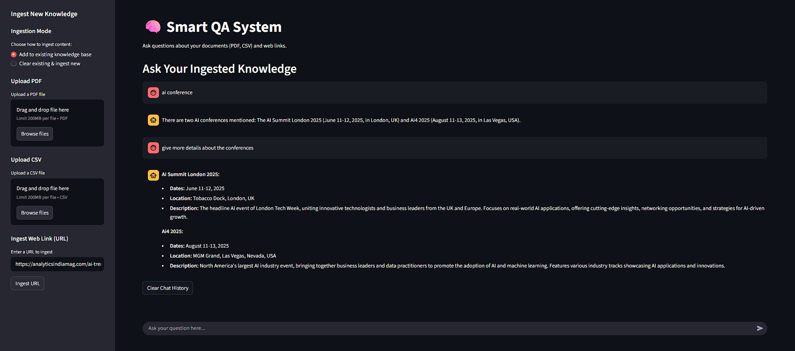

# 🧠 Smart Q&A System
A RAG-powered Q&A system using FastAPI and Streamlit, leveraging Google's Generative AI. Ingest documents, web links, and CSVs to ask natural language questions.


✨ Features
Multi-Source Ingestion: Upload PDFs, Word documents (.docx), ingest web URLs, and CSV files.

Intelligent Q&A: Ask questions about ingested content with conversational memory.

Persistent Knowledge Base: Local ChromaDB stores embeddings for continuous learning.

Knowledge Base Management: Option to clear all ingested data.

User-Friendly Interface: Intuitive web UI built with Streamlit.

🚀 Technologies Used
Backend (FastAPI):
FastAPI: Web API framework.
LangChain: LLM orchestration.
langchain-google-genai: Google Gemini integration.
langchain-chroma: ChromaDB integration.
langchain-community: Document loaders.
ChromaDB: Local vector database.
Unstructured: Document parsing (.docx).
Pandas: CSV processing.
Uvicorn: ASGI server.
python-dotenv, python-multipart.

Frontend (Streamlit):
Streamlit: Web app UI.
Requests: HTTP client.
🛠️ Setup and Installation
Prerequisites
Python 3.9+

pip

Steps
Clone/Navigate to Project:

```
git clone https://github.com/Creating-Content/RAG-Smart-QA-System
cd Smart_QA_System
```

Create and Activate Virtual Environment:
```
python -m venv venv
.\venv\Scripts\activate # Windows PowerShell
# source venv/bin/activate # macOS/Linux
```

Install Required Python Packages:
```
pip install fastapi uvicorn python-dotenv pandas langchain-community langchain-google-genai "unstructured[docx]" python-magic-bin streamlit requests chromadb langchain-chroma
```
Set Up Google Gemini API Key:
Create .env in project root:
```
GOOGLE_API_KEY="YOUR_GEMINI_API_KEY_HERE"
```
🏃 How to Run the Application
Run backend and frontend in separate terminals.

Start FastAPI Backend:
```
.\venv\Scripts\activate
uvicorn main:app --host 0.0.0.0 --port 8000
```
Start Streamlit Frontend:
```
.\venv\Scripts\activate
streamlit run streamlit_app.py
```
💡 How to Use the Application
Ingest Knowledge:

Use sidebar options: "Upload Document" (PDF/DOCX), "Ingest Web Link (URL)", "Ingest CSV File".

Choose "Add to existing" or "Clear existing & ingest new".

## Example 1: Upload Document

## Asking a Question


Clear Chat History: Button at bottom clears chat, not knowledge base.

## Example 2: Upload Url

## Asking a Question



🛑 Troubleshooting
ModuleNotFoundError: Reinstall packages, recreate venv.

API Error: 500 or 404: Restart FastAPI backend after code changes.

"I am unable to find the answer...": Verify ingestion, clear/re-ingest, check chunk_size/overlap.

File Locking Issues: Terminate all Python processes.
